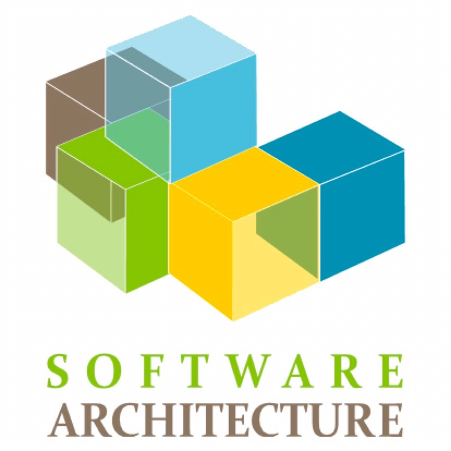

# 软件体系结构
## Software Architecture

---

## 课程信息

<!-- .element: style="float: right; width: 30%; vertical-align: buttom" -->

<section>
- https://github.com/njuics/sa-2018 

- 课件、示例代码、日志及其他 </section> <!-- .element: style="width: 40%" -->

---

## QQ群

  <!-- .element height="60%" width="35%" -->

---

## 这门课是学什么的？

软件设计

---

## The End