# MVC
## Model-View-Controller

---

## Spring Batch Demo

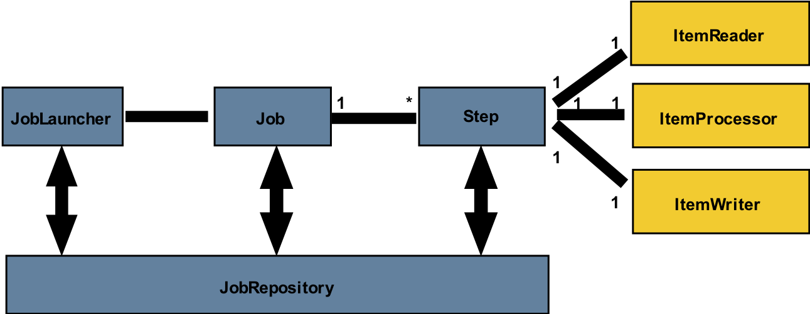

mvn exec:java （等同于 java App）

---

## Web Applications

 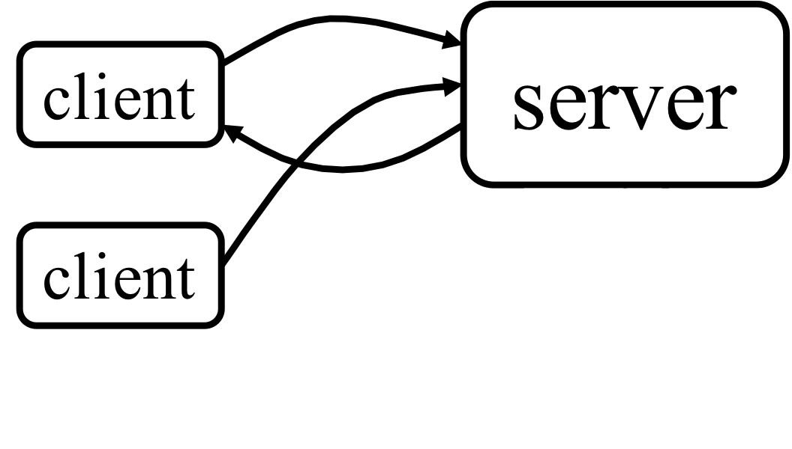 <!-- .element height="50%" width="50%" -->

---

## Static Pages

 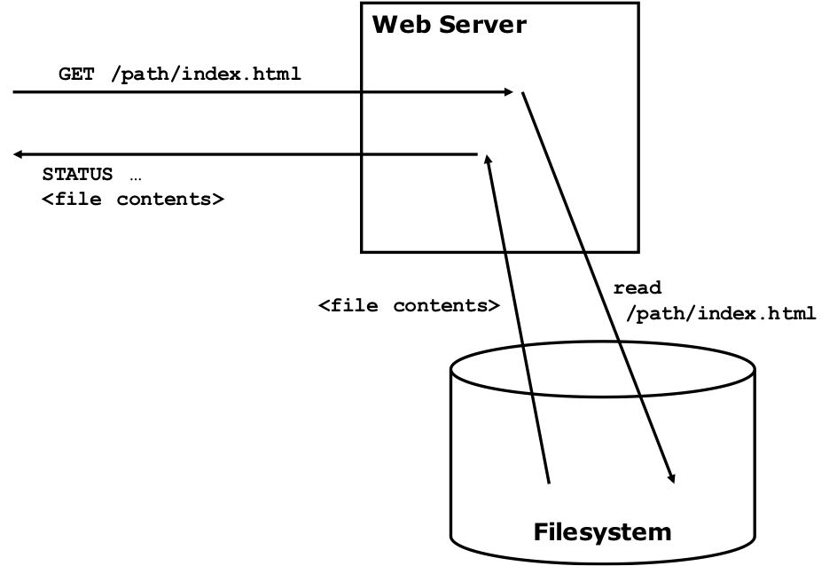 


---

## Dynamic Content

 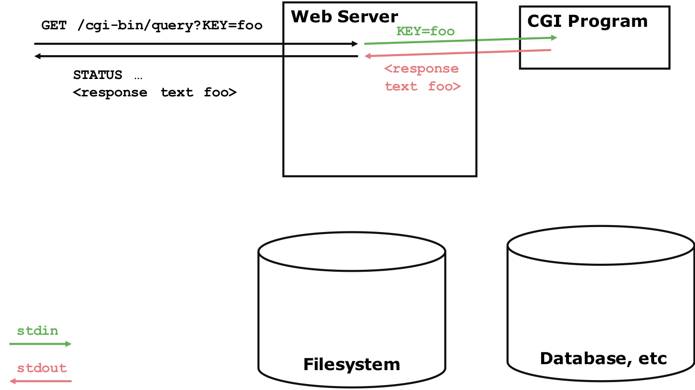 


---

## CGI

- CGI: Common Gateway Interface
  - Oldest standard
  - Forward requests to external programs
  - Spawn one process for each new request (ouch!)
  - Communicate via
    - Standard input/output
    - Environment variables
    - Process terminates after request is handled


---

## CGI

 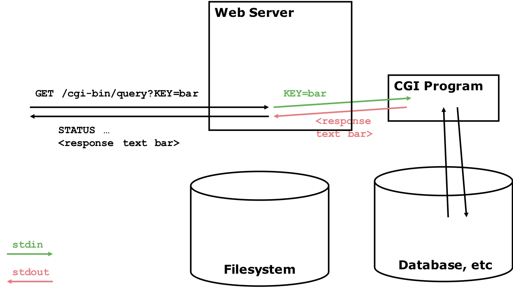 


---

## CGI Example

``` perl
#!/usr/bin/perl

=head1 DESCRIPTION

printenv — a CGI program that just prints its environment

=cut
print "Content-type: text/plain\n\n";

for my $var ( sort keys %ENV ) {
 printf "%s = \"%s\"\n", $var, $ENV{$var};
}
```

Inefficient

No persistent state


---

## Output

``` bash
COMSPEC="C:\Windows\system32\cmd.exe"
DOCUMENT_ROOT="C:/Program Files (x86)/Apache Software Foundation/Apache2.2/htdocs"
GATEWAY_INTERFACE="CGI/1.1"
HOME="/home/SYSTEM"
HTTP_ACCEPT="text/html,application/xhtml+xml,application/xml;q=0.9,*/*;q=0.8"
HTTP_ACCEPT_CHARSET="ISO-8859-1,utf-8;q=0.7,*;q=0.7"
HTTP_ACCEPT_ENCODING="gzip, deflate"
HTTP_ACCEPT_LANGUAGE="en-us,en;q=0.5"
HTTP_CONNECTION="keep-alive"
HTTP_HOST="example.com"
HTTP_USER_AGENT="Mozilla/5.0 (Windows NT 6.1; WOW64; rv:5.0) Gecko/20100101 Firefox/5.0"
PATH="/home/SYSTEM/bin:/bin:/cygdrive/c/progra~2/php:/cygdrive/c/windows/system32:..."
PATHEXT=".COM;.EXE;.BAT;.CMD;.VBS;.VBE;.JS;.JSE;.WSF;.WSH;.MSC"
PATH_INFO="/foo/bar"
PATH_TRANSLATED="C:\Program Files (x86)\Apache Software Foundation\Apache2.2\htdocs\foo\bar"
QUERY_STRING="var1=value1&var2=with%20percent%20encoding"
REMOTE_ADDR="127.0.0.1"
REMOTE_PORT="63555"
REQUEST_METHOD="GET"
REQUEST_URI="/cgi-bin/printenv.pl/foo/bar?var1=value1&var2=with%20percent%20encoding"
SCRIPT_FILENAME="C:/Program Files (x86)/Apache Software Foundation/Apache2.2/cgi-bin/printenv.pl"
SCRIPT_NAME="/cgi-bin/printenv.pl"
SERVER_ADDR="127.0.0.1"
SERVER_ADMIN="(server admin's email address)"
SERVER_NAME="127.0.0.1"
SERVER_PORT="80"
SERVER_PROTOCOL="HTTP/1.1"
SERVER_SIGNATURE=""
SERVER_SOFTWARE="Apache/2.2.19 (Win32) PHP/5.2.17"
SYSTEMROOT="C:\Windows"
TERM="cygwin"
WINDIR="C:\Windows"
```


---


## Servlet

- Little Java programs…
    - Contain application-specific code
    - Web server does generic part of request handling
    - Servlets run “in” the web server and do some of the handling

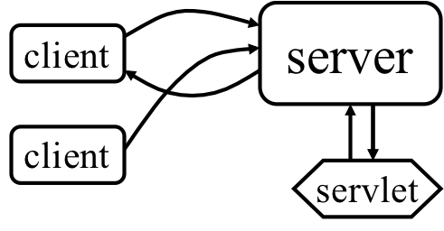 <!-- .element height="20%" width="30%" -->


---

## Servlet

- Client sends a request to server
- Server starts a servlet
- Servlet computes a result for server and does not quit
- Server returns response to client
- Another client sends a request
- Server calls the servlet again


---

## Servlet

- Highlights
    - Standard!
    - Efficiency (much better than CGI)
    - Security (Java!)
    - Persistence (handle multiple requests)

 <!-- .element height="20%" width="30%" -->


---


## Advantages and Disadvantage

- Advantages
     - Running a servlet doesn’t require creating a separate process each time
     - A servlet stays in memory, so it doesn’t have to be reloaded each time. It handles multiple requests
     - Untrusted servlets can be run in a “sandbox”
- Disadvantage
     - Less choice of languages (CGI scripts can be in any language)


---

## Servlets

 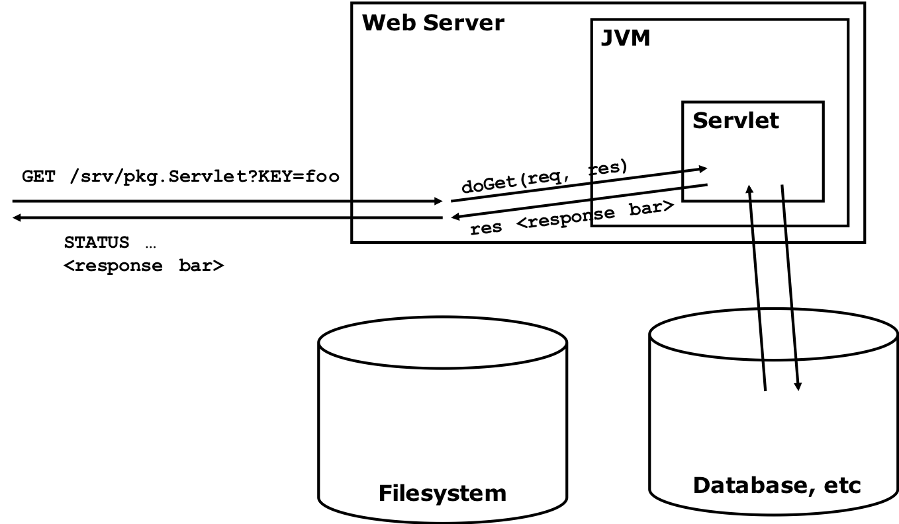 


---

## Tomcat and Apache

- Tomcat is the Servlet Engine than handles servlet requests for Apache
  - Tomcat is a “helper application” for Apache
  - It’s best to think of Tomcat as a “servlet container”
- Apache can handle many types of web services
  - Apache can be installed without Tomcat
  - Tomcat can be installed without Apache

---

## Servlets

- A servlet is any class that implements the `javax.servlet.Servlet` interface 
  - In practice, most servlets extend the `javax.servlet.http.HttpServlet` class
  - Some servlets extend `javax.servlet.GenericServlet` instead 
- Servlets, like applets, usually lack a main method, but must implement or override certain other methods

---

## HTTP Requests

- When a request is submitted from a Web page, it is almost always a GET or a POST request
- The `GET` action results in the form information being put after a `?` in the URL
  - For example: http://www.google.com/search?hl=en&ie=UTF-8&oe=UTF-8&q=servlets
  - The `&` separates the various parameters
  - Only a limited amount of information can be sent this way
- `PUT` can send large amounts of information 

---

## Requests

- The service method dispatches the following kinds of requests: `DELETE`, `GET`, `HEAD`, `OPTIONS`, `POST`, `PUT`, and `TRACE`
  - A `GET` request is dispatched to the `doGet` method
  - A `POST` request is dispatched to the `doPost` method
  - These are the two methods you will usually override
  

---

## Hello World Servlet

```java
package pkg;

import java.io.*;
import javax.servlet.*;
import javax.servlet.http.*;

public class Servlet extends HttpServlet {
  public void doGet(HttpServletRequest req, HttpServletResponse res) throws IOException, ServletException {
         res.setContentType("text/html");
         PrintWriter out = res.getWriter();
         out.println("<html><head><title>Sample Servlet");
         out.println("</title></head><body>");
         out.println("<h1>Hello World at " + 
                     req.getRequestURI() + " !</h1>");
         out.println(”<p>Key is " + req.getParameter("KEY"));
         out.println(”</p></body></html>");
    }
}
```

---

## Servlet Demo

https://github.com/njuics/sa2017/tree/master/ServletDemo

---

## Summary

 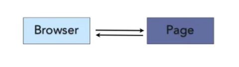 

 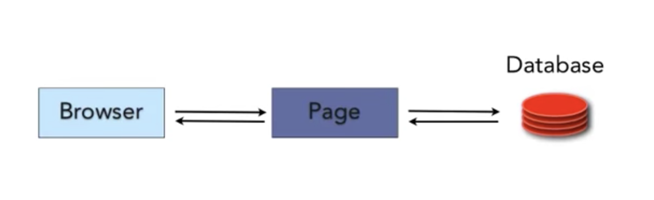 

---

## Next

Add a web interface for our Spring batch demo application


---

## A Big Picture

 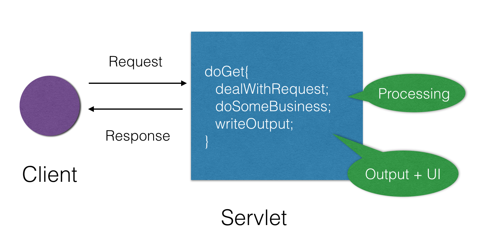 

---


## Problems

How about “changes”？

- Context
     - 人机交互界面设计
- Problem
     - 系统功能的变化要求用户界面的改变
     - 系统升级要求用户界面的升级
     - 系统平台的改变（移植）要求用户界面随之改变
     - 用户界面的改变需足够方便
     - 用户界面的改变不应影响系统功能本身


---

## Some changes

 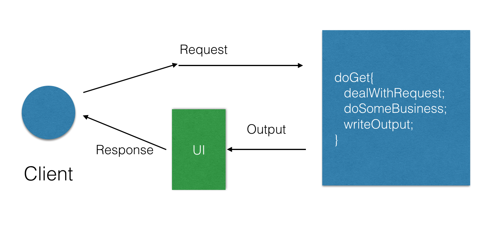 

---

## More changes

 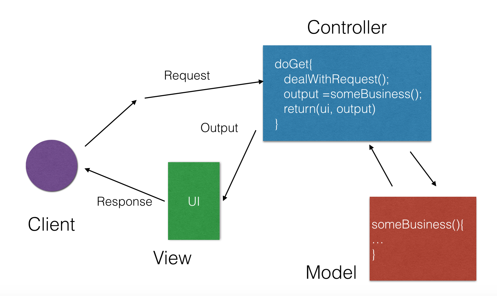 


---

## Solution： MVC

- 系统分割为processing, output和input三个部分
  - “Model”: processing，核心数据和功能，
  - “View”: output, 从Model获得数据并显示给用户, 
  - “Controller”: input, 处理事件操作模型


--- 

## MVC


 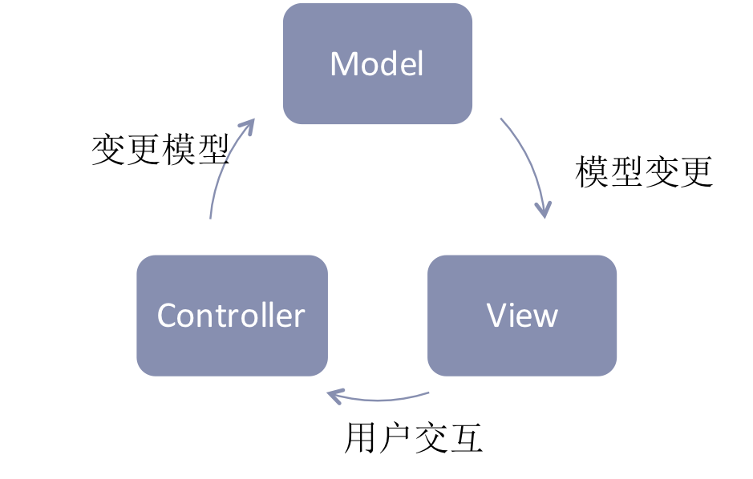 <!-- .element height="50%" width="60%" -->

---

## Examples

- Graphical Editing Framework (GEF)
- Spring MVC
- ASP.Net MVC
- Struts
- Flask
- …

---

## GEF

- The Graphical Editing Framework (GEF) allows developers to take an existing application model and quickly create a rich graphical editor.

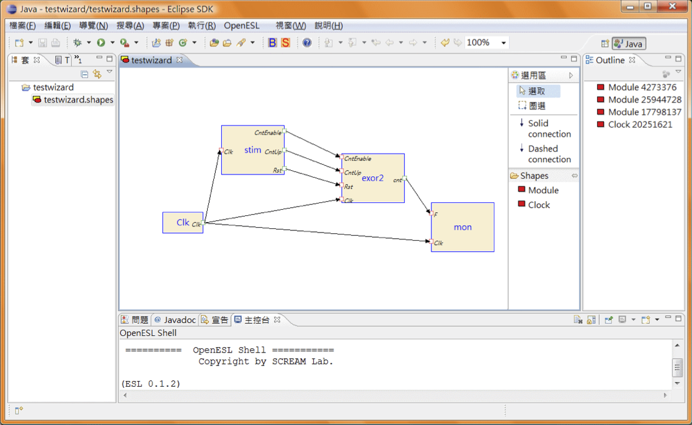 <!-- .element height="50%" width="50%" -->


---

## Spring

- Spring is a non-invasive application development framework that aims to make the life easier for Java/J2EE developers, by
  - Providing a DI (or IoC) container.
  - Providing an AOP framework that delivers services such as declarative transaction management.
  - Providing abstraction for more complicated services and APIs by removing ”boilerplate code”.
  - DI + AOP + Service Abstraction = Power to the POJO

---

## Spring Framework

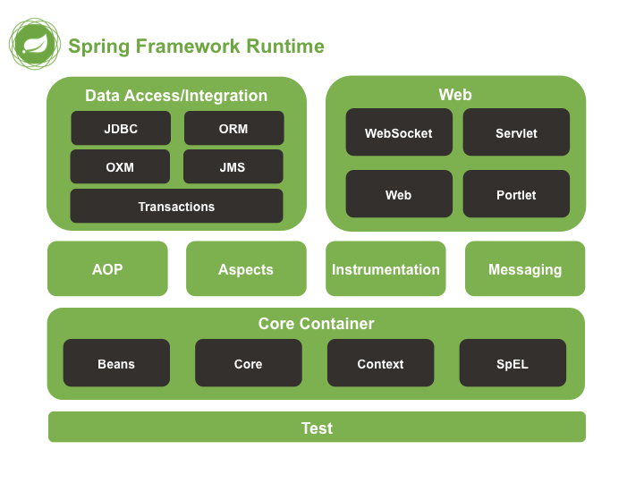


---

## Spring MVC

- Spring’s own implementation of Web MVC
- Integrates nicely with the middle-tier via DI
- The components of the web framework is loosely coupled
- Supports several view technologies
  - JSP/Tiles, Velocity, FreeMarker
- Support integration with other MVC frameworks
  - Struts, Tapestry, JavaServerFaces, WebWork
- Provides a JSP Tag Library


---

## Web MVC

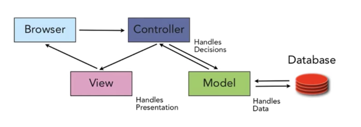


		
---

## Servlet Engine

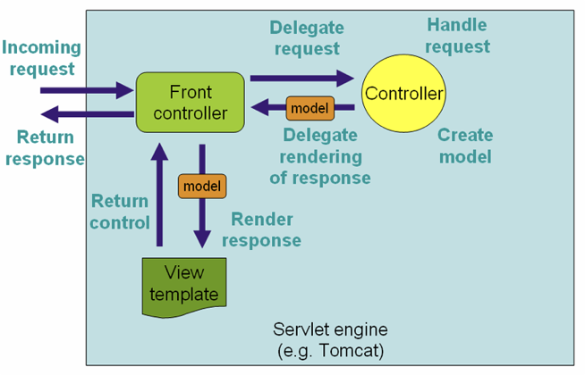


---

## Spring MVC

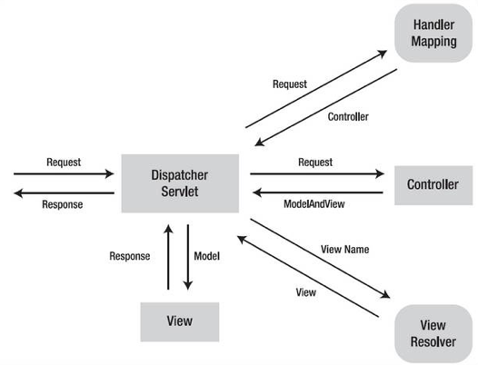

---

## Demo


https://github.com/njuics/sa2017/tree/master/springmvc

---

## Get it work

```bash
$ mvn jetty:run
```


---

## How It Works?


---

# THE END