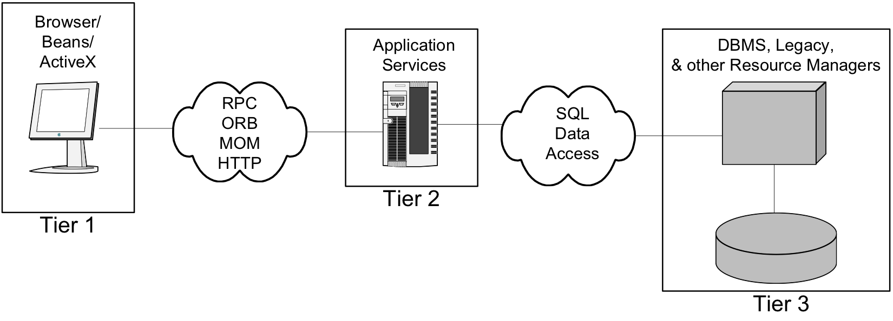

# Client-Server Architecture

---

## 背景

早期集中式计算环境采用终端-主机（ Terminal-Mainframe）结构。所有计算、处理都由主机完成。随用户增加，对主机要求越来越高


---

## PC


上世纪70～80年代，个人计算机和计算机网络开始流行，计算、处理迁移到用户的个人计算机上，较为有效的解决了主机性能问题。

 


---

## 解决方案

- 任务分割：用户方 vs. 主机方
  - 用户端处理能力相对较弱，需要向主机提供进行服务
    - 计算资源—交予复杂计算任务，等待结果
    - 存储资源—数据存储、查询
- 产生角色分配：Client vs. Server

---

## C/S Architecture

 <!-- .element height="45%" width="60%" -->


静态结构：Clients、Servers、Communication Network


---

## Client

- Applications that run on computers
- Rely on servers for
  - Files
  - Devices
  - Processing power
- Example: E-mail client
  - An application that enables you to send and receive e-mail

---

## Server

- Computers or processes that manage resources
  - Disk drives (file servers)
  - Printers (print servers) 
  - Network traffic (network servers)
  - ßExample: Database Server


---

## Communication Networks

  <!-- .element height="45%" width="60%" -->

Networks connect clients and servers

---

## 动态行为

- Clients：Request sender
  - Initiates requests
  - Waits for and receives replies.
  - Usually connects to a small number of servers at one time
  - Typically interacts directly with end-users using a graphical user interface


---

## 动态行为

- Servers
  - Passive
  - Waits for requests from clients
  - Upon receipt of requests, processes them and then serves replies 
  - Usually accepts connections from a large number of clients 
  - Typically does not interact directly with end-users


---


## Server类型

- Ftp Servers
- Web Servers
- Print Servers
- Mail Servers
- Chat Servers
- Groupware Servers
- News Servers
- Proxy Servers
- Mail Servers
- Telnet Servers
- ...


---

## Fat or Thin?

- Application tiers

 <!-- .element height="50%" width="80%" -->


---

## Fat Clients

- 应用系统在Client端运行，Client知道Server上的数据、文件等如何组织和存储
- 是一种C/S模式的传统形式，一般用户个人软件系统

 <!-- .element height="25%" width="60%" -->

为用户端程序的设计和开发提供较大的灵活性和便利性


---


## Thin Clients

- Server通过一组确定的过程（或方法）提供资源的访问，而不是提供对资源的直接操作
- Client提供GUI界面供用户进行操作，并通过远程方法调用与Server通信，获得服务


 <!-- .element height="25%" width="60%" -->

应用代码集中于Server端，便于部署和管理，减少网络通信开销

---

## From 2-tiers to 3 tiers

  


---

C/S架构优点

- 资源共享
- 集中化管理
- 性能分布
- 安全
- …


---

## To B/S


 


---

## J2EE Platform ( Java EE)

- 多层应用平台
  - 用户界面：Client Tier
  - 业务逻辑：Middle Tier(s)
  - 数据管理：Backend Tier

---

## Java EE

 <!-- .element height="50%" width="60%" -->


---

## JavaServer Pages

``` html
<html>
  <body> 
Good morning
</body>
</html>
```

``` jsp
<html>
  <body> 
<% java.util.Date theDate = new java.util.Date( ); %> 
<% if (theDate.getHours( ) < 12) { %> 
    Good morning,
 <% } else { %> 
    Good afternoon, 
<% } %> 
    visitor. It is now <%= theDate.toString( ) %> 
  </body> 
</html>
```

  

---

## Java Servlet

 

---

## A generic servlet


``` java
import javax.servlet.*;
import java.io.*; 

public class BasicServlet extends GenericServlet { 
	public void service(ServletRequest req, ServletResponse resp)
			throws Servl Generic Servlet etException, IOException { 
		resp.setContentType("text/plain"); 
		PrintWriter out = resp.getWriter( ); 
		out.println("Hello.");
	} 
}

```

---

## A HTTP Servlet 

``` java
import javax.servlet.*; 
import javax.servlet.http.*; 
import java.io.*; 
public class HelloWorldServlet extends HttpServlet { 
	public void doGet(HttpServletRequest req, HttpServletResponse resp) 
			throws ServletException, IOException { 
		resp.setContentType("text/html"); 
		PrintWriter out = resp.getWriter( ); 
		out.println("<html>"); 
		out.println( "<head><title>Have you seen this before?</title></head>"); 
		out.println( "<body><h1>Hello, World!</h1><h6>Again.</h6></body></html>"); 
	} 
} 

```

---

## Web-centric applications

 

The Web container is essentially hosting both presentation and business logic,


---

## Spring

  

---


## Web-centric app with Spring 

Serving Web Content with Spring MVC

https://spring.io/guides/gs/serving-web-content/


---

##  PetClinic

http://projects.spring.io/spring-petclinic/

---

## Classic PetClinic


https://github.com/spring-projects/spring-petclinic

A Spring Framework application based on JSP, Thymeleaf, Spring MVC, Spring Data JPA


---
## What’s Next?


 

---

## Scalability

 


Scale-up VS. Scale-out

---

## To Scale-out

  <!-- .element height="60%" width="60%" -->

Load balancing

---

## Load Balancing

Transport-level

VS.

Application-level

---

## Transport-level Load Balance


 <!-- .element height="60%" width="50%" -->


DNS-based load balancing

---

## Transport-level Load Balance


 <!-- .element height="70%" width="80%" -->


TCP/IP server load balancing


---

## Cache

 <!-- .element height="70%" width="80%" -->

Object n -> Cache Server m ?

---

## Consistent hashing


 

```
Hash(object1) = key1；
Hash(object2) = key2；
Hash(object3) = key3；
Hash(object4) = key4;
Hash(NODE1) = KEY1;
Hash(NODE2) = KEY2;
Hash(NODE3) = KEY3;
```

---

## Remove a node
 

---

## Add a node
 

---

## Balancing

 

 <!-- .element height="35%" width="40%" -->

---

## What’s More?

Application session data and… 
Client affinity

---

## Application-level load balance


 <!-- .element height="70%" width="80%" -->


Client identification: Parameters vs. Cookies

---

## Application-level load balance

 

HTTP redirect-based server load balancer

---

## Application-level load balance


 <!-- .element height="70%" width="80%" -->


Server-side server load balancer interceptor

---

## Application-level load balance


 <!-- .element height="70%" width="80%" -->

Client-side server load balancer interceptor


---

## Session?

 

---

## Tomcat Cluster

 

---

## Session Management

 


https://github.com/magro/memcached-session-manager

---

# END