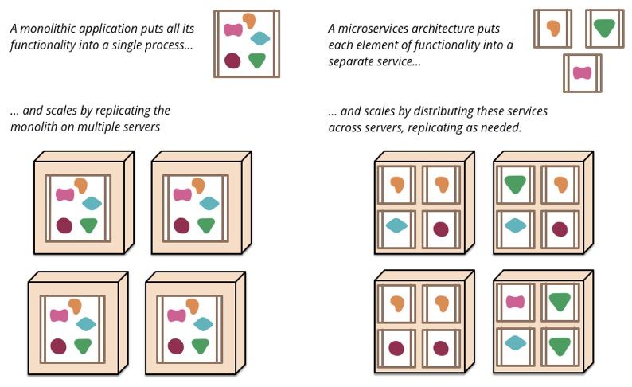
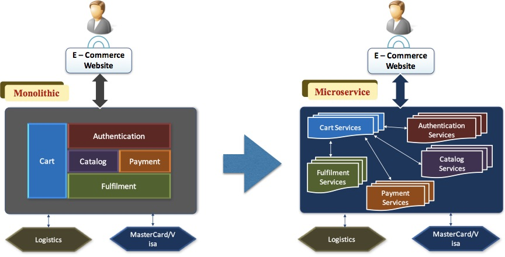
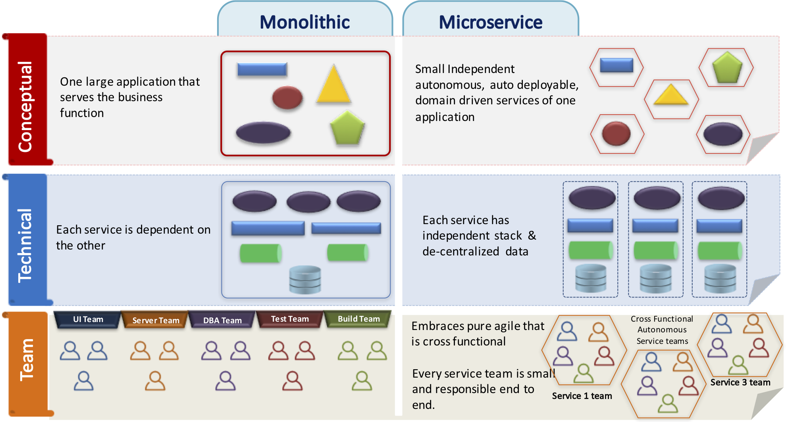
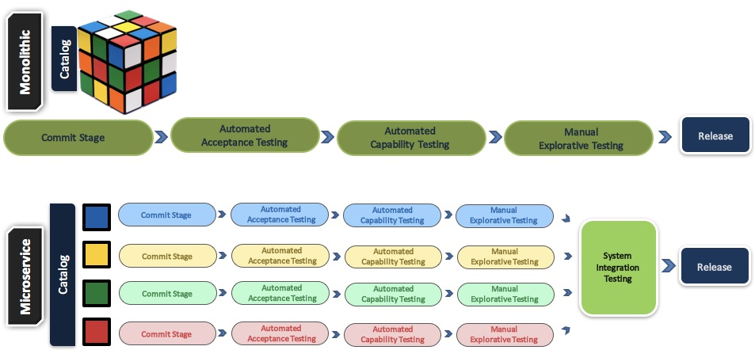
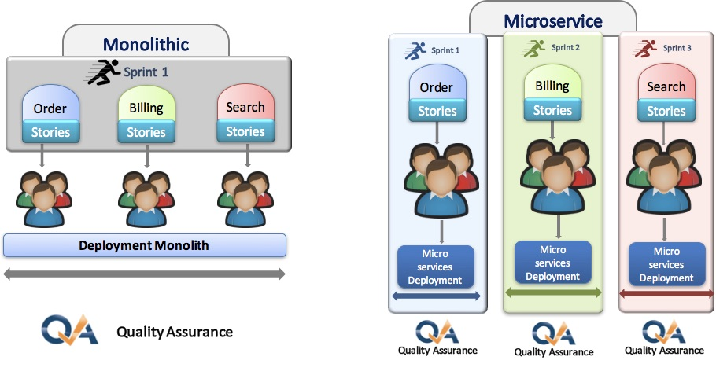
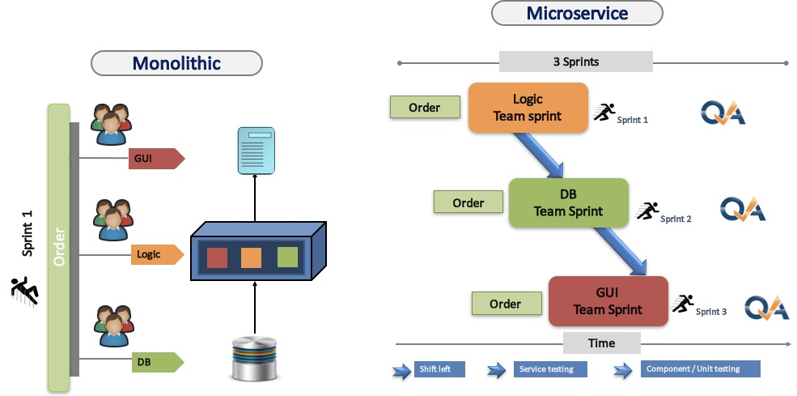
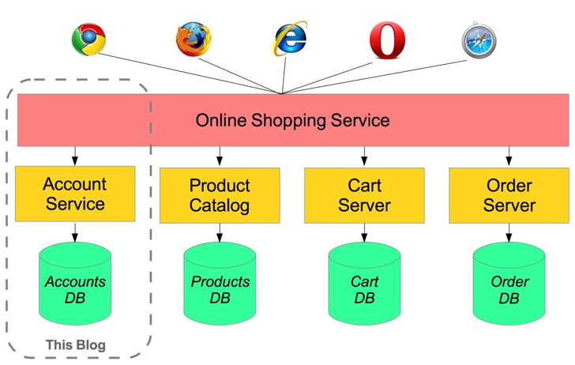
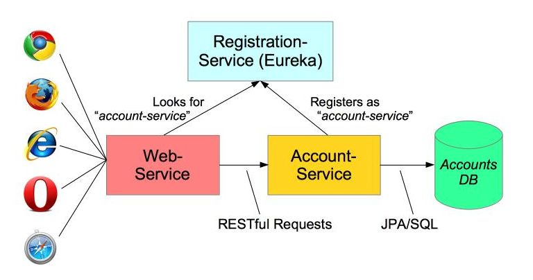

# Microservice

---

## Microservice

The microservice architectural style is an approach to developing a single application as a suite of small services, each running in its own process and communicating with lightweight mechanisms, often an HTTP resource API. These services are built around business capabilities and independently deployable by fully automated deployment machinery. There is a bare minimum of centralized management of these services, which may be written in different programming languages and use different data storage technologies.

---

## Monoliths and Microservice

 

---

## Breaking Monolithic to Smaller Services

 

---

## Petclinic Microservice

 https://github.com/spring-petclinic/spring-petclinic-microservices

---

## Monoliths vs. Microservice

 

---

## DevOPS

 

Microservices can only be deployed independently if tests are independent & if your Continuous Delivery Pipeline works

---

## Sprints

  

---

## Team

  

---

## 例

  

https://spring.io/blog/2015/07/14/microservices-with-spring

---

## 简化

 

---

## PetClinic Microservices

https://github.com/spring-petclinic/spring-petclinic-microservices

https://github.com/mszarlinski/spring-petclinic-microservices

---

## Spring Cloud

- Service Discovery
- Config Server
- REST Client
- Router and Filter
- Tracing Server
- Circuit Breaker
...

---

# END